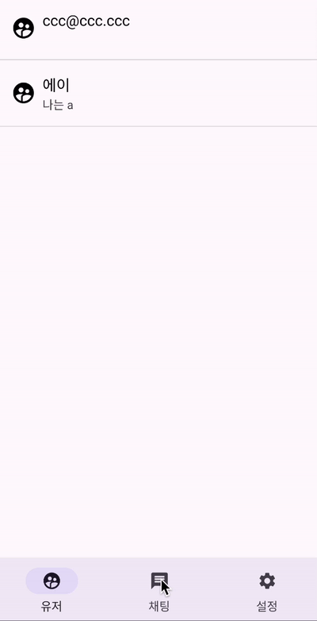
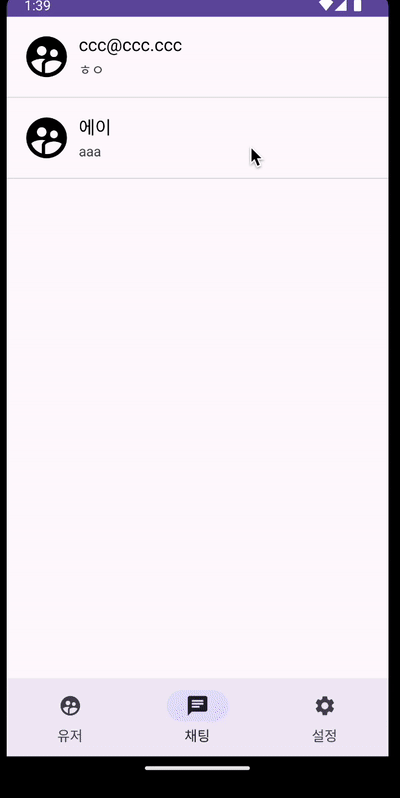

# 이지톡

Android 개인 프로젝트

## 🤞 프로젝트 소개

원하는 유저와 1:1로 대화할 수 있는 채팅 앱

### 🖥️ 개발 환경

- Programming Language : `Kotlin`
- IDE : `Android Studio`
- Minimum SDK Version : `28`
- Compile SDK Version : `33`
- Target SDK Version : `33`

## 🔎 페이지 기능

|                        로그인 페이지                         |                  유저 / 채팅 / 설정 페이지                   |                       채팅 상세 페이지                       |
| :----------------------------------------------------------: | :----------------------------------------------------------: | :----------------------------------------------------------: |
|  |  |  |